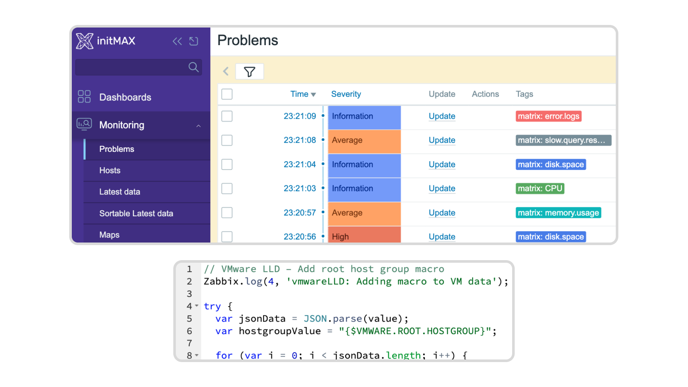

<!-- *********************************************************************************************************************************** -->
<!-- *** HEADER ************************************************************************************************************************ -->
<!-- *********************************************************************************************************************************** -->

    
    <h3>
        
            Honesty, diligence and MAXimum knowledge of our products is our standard.
        
    </h3>
    <h3>
        &nbsp;&nbsp;&nbsp;
        &nbsp;&nbsp;&nbsp;
        &nbsp;&nbsp;&nbsp;
        &nbsp;&nbsp;&nbsp;
        &nbsp;&nbsp;&nbsp;
        
    </h3>

 
 

---
---

    <h1>
        uxMAX <!-- !!! change version !!! -->
    </h1>
    <h4>
        The uxMAX module enhances Zabbix by providing advanced UI configuration options that improve clarity and overall user experience. <!-- !!! change version !!! -->
    </h4>
     
     <!-- !!! change version !!! -->
     <!-- !!! change version !!! -->
     
     <!-- !!! change version !!! -->

 
 

<!-- *********************************************************************************************************************************** -->
<!-- *** BODY ************************************************************************************************************************** -->
<!-- *********************************************************************************************************************************** -->
## Description

The uxMAX module enhances Zabbix by providing advanced UI configuration options that improve clarity and overall user experience. Key features include:

- **Customizable Color Themes**: Tailor the interface with body and navigation background colors.
- **Draggable Modal Windows**: Enable easy repositioning of modal dialogs.
- **Code Highlighting**: Syntax highlighting with adjustable font size and style for better readability.
- **Enhanced Navigation**: Improved layout and navigation for a seamless user experience.
- **Compatibility**: Fully compatible with Zabbix 7.0 and PHP 8.0.

  

    <a href="https://www.initmax.com/wiki/uxmax/" style="display: inline-block; padding: 10px 20px; font-size: 16px; color: white; background-color: #007BFF; text-decoration: none; border-radius: 5px;">Documentation</a>

---
---

    <h4>
        <a href="https://www.initmax.com/" style="display: inline-flex; align-items: center; gap: 5px; color: inherit; text-decoration: none;">
            
            initMAX.com
        </a>&nbsp;&nbsp;&nbsp;
        <a href="tel:+420800244442" style="display: inline-flex; align-items: center; gap: 5px; color: inherit; text-decoration: none;">
            
            +420800244442
        </a>&nbsp;&nbsp;&nbsp;
        <a href="mailto:info@initmax.com" style="display: inline-flex; align-items: center; gap: 5px; color: inherit; text-decoration: none;">
            
            info@initmax.com
        </a>
          
        &nbsp;
        &nbsp;
        &nbsp;
        &nbsp;
        &nbsp;
           
        &nbsp;&nbsp;&nbsp;
        
           
        
    </h4>

