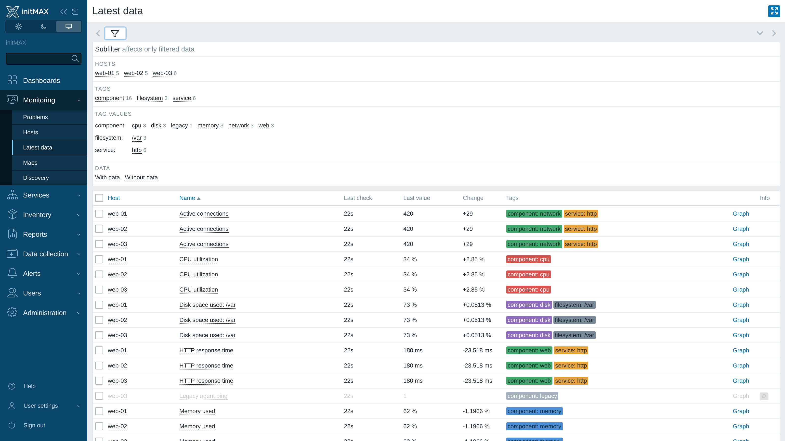
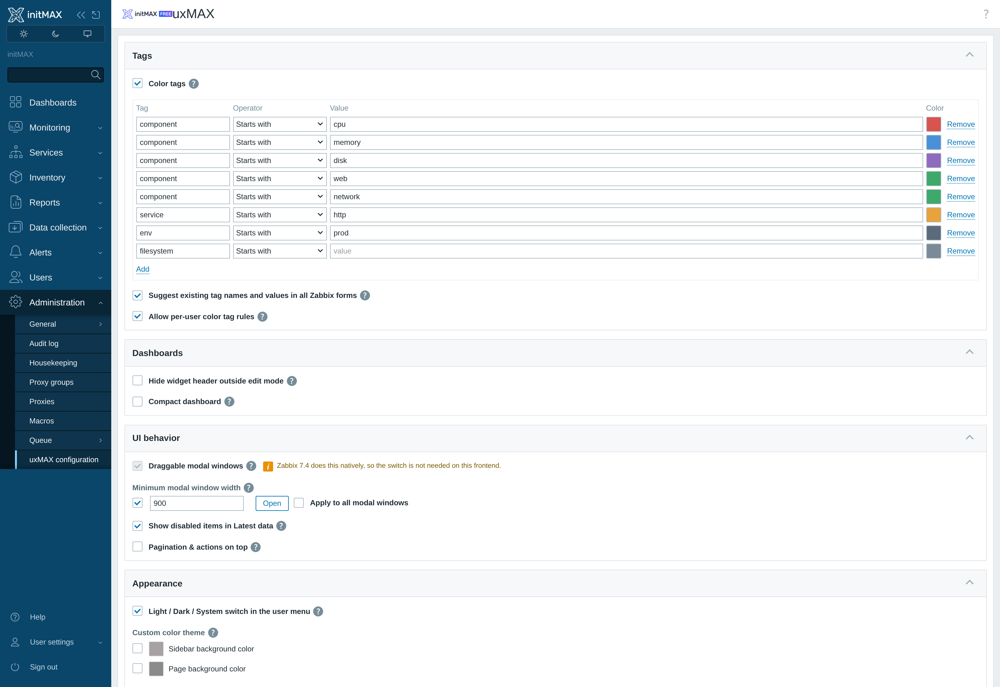
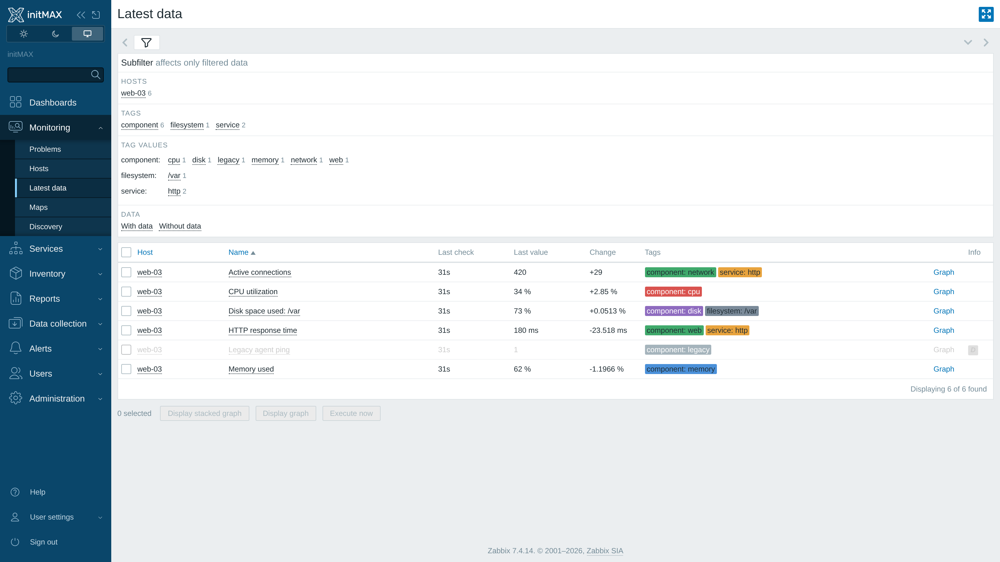
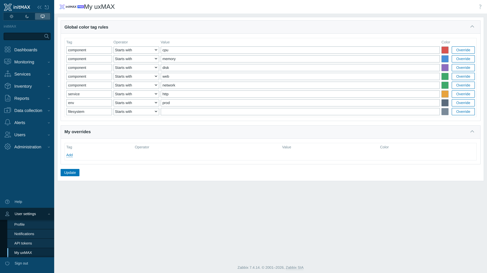
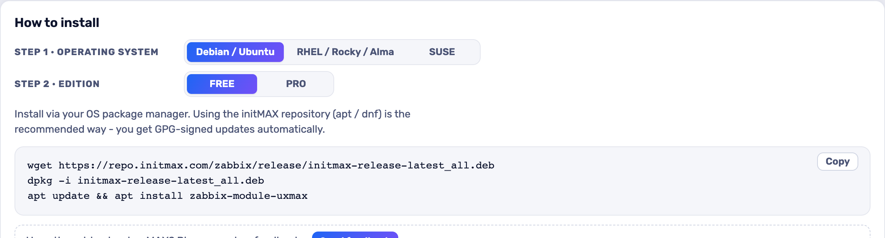

<h1>uxMAX</h1>

developed and maintained by

and community

<strong>The Zabbix frontend, adjusted to the way your team actually works.</strong> 
Colour-coded tags you can read across the room, dashboards without wasted space, a font you can live with, syntax highlighting where you write code - a dozen small changes, one switch each, no forked frontend.

<a href="#what-you-can-build"><strong>Features</strong></a> &nbsp;·&nbsp;
<a href="#examples"><strong>Examples</strong></a> &nbsp;·&nbsp;
<a href="#install"><strong>Install</strong></a> &nbsp;·&nbsp;
<a href="#free-vs-pro"><strong>FREE vs PRO</strong></a> &nbsp;·&nbsp;
<a href="https://portal.initmax.com"><strong>Portal</strong></a> &nbsp;·&nbsp;
<a href="https://www.initmax.com/wiki/uxmax/"><strong>Docs</strong></a>

 

---

## Why uxMAX

Zabbix is generous with what it monitors and sparing with how you look at it. uxMAX adds the adjustments people end up asking for after a few months of living in the interface - each one a single checkbox in one place, each one reversible, none of them a fork of the frontend.

**Colour tags.** Pick a tag name and colour it by a value rule everywhere tags appear - Problems, Hosts, Latest data. On a busy problem list, `service: web` in orange and `env: prod` in grey is the difference between reading and scanning. Value rules match on *starts with*, *contains* or *ends with*, and you can let each user layer their own rules on top of the global ones.

**Dashboards without the gaps.** Remove the padding Zabbix reserves around every widget, and hide the header of any widget you have marked "no header" so it stays hidden outside edit mode. On a wall display that is a couple of extra rows.

**Items you disabled, still where you left them.** Latest data lists only enabled items, so an item somebody switched off simply vanishes - and the next person spends ten minutes working out whether it was deleted, renamed, or is just not collecting. Switch this on and disabled items stay in the list, greyed out and marked **D** in the Info column, so the answer is on screen. Filtering, sorting and mass actions treat them like any other row.

**Colour rules each user can bend.** The global rules are the house style; individual users often need one more of their own. **User settings → My uxMAX** shows every user the global rule set read-only and lets them layer their own rules on top - matching Tag + Operator + Value replaces that colour, a new combination adds to it. If you would rather keep one palette for everyone, switch it off in the configuration and the menu entry is not there at all.

**Tag suggestions wherever Zabbix asks for a tag.** Turn the option on once and every Tag / Value pair - filters, object forms, popups and widget configuration - suggests names and matching values already used on objects the signed-in user may see. The fields remain normal free-text inputs, so macros, wildcards and regular expressions keep working wherever the underlying Zabbix form supports them.

**Long lists without the round trip.** Zabbix keeps the paging controls and the mass-action buttons at the very bottom of a list. On a long Latest data page that means scrolling to the end to turn the page, and back up to carry on reading. uxMAX mirrors both in a bar above the list - and only when the page is actually long enough to scroll, so short lists look exactly as they did.

## What you can build

<table>
<tr>
<td width="50%" valign="top">

**Colour-coded tags**

Rules by starts with / contains / ends with paint tags the same colour everywhere in the frontend.

</td>
<td width="50%" valign="top">

**Per-user rules on top**

Users add their own tag colours without touching the global rule set.

</td>
</tr>
<tr>
<td width="50%" valign="top">

**Sidebar and background colours**

Tell production from staging at a glance - or match the corporate palette.

</td>
<td width="50%" valign="top">

**Highlighting where you write code**

JavaScript in Script and Browser items and discovery rules, webhook media types and Administration scripts, and preprocessing; Zabbix expressions in triggers and calculated items - two separate switches.

</td>
</tr>
<tr>
<td width="50%" valign="top">

**Your own frontend font**

From a Google Fonts URL, or upload the file and have Zabbix serve it locally - which also works on air-gapped instances.

</td>
<td width="50%" valign="top">

**Draggable, wider modals**

Move dialog windows around and set a minimum modal width for long forms.

</td>
</tr>
<tr>
<td width="50%" valign="top">

**Disabled items kept in sight**

Latest data keeps items you switched off, greyed out and marked D instead of hiding them.

</td>
<td width="50%" valign="top">

**Pagination and actions on top**

Paging and mass actions mirrored above long lists, so there is no scroll to the bottom and back.

</td>
</tr>
<tr>
<td width="50%" valign="top">

**Light, Dark or System**

A switch in the user menu. System follows the operating system's own setting and keeps following it, which Zabbix on its own cannot do.

</td>
<td width="50%" valign="top">

**Your logo, your footer**

Replace the Zabbix logo, footer line and help link. Set it once - every frontend in the cluster applies it for itself, including a node added later.

</td>
</tr>
</table>

## Examples

<table>
<tr>
<td width="50%" align="center" valign="top"> <small><b>Configuration</b> - Configure color-tag rules, compact dashboards, hidden widget headers, draggable dialogs and other interface improvements in one place.</small></td>
<td width="50%" align="center" valign="top"> <small><b>Latest data</b> - A disabled item stays in the list, greyed out and marked D, so nobody hunts for data that is not being collected.</small></td>
</tr>
<tr>
<td width="50%" align="center" valign="top"> <small><b>User preferences</b> - My uxMAX: each user sees the global colour rules and can layer their own on top when the administrator allows it.</small></td>
</tr>
</table>

## Configuration

Everything lives on one page: **Administration → uxMAX configuration**. Each row is a switch with a plain-English explanation next to it; there is no separate documentation you have to hold in your head.

Users get their own small page under **User settings → My uxMAX**, where they can add colour-tag rules of their own on top of the global ones. Administrators can switch that off, and then the menu entry is not there at all.

## Install

**FREE** ships as **GPG-signed `deb` / `rpm` packages** from the initMAX repository - `apt` / `dnf` installs them and keeps them updated.

### Easiest way - the guided installer on the Portal

Open the product page, pick your **OS** and **edition**, and copy the ready-made command. FREE is fully public (no login); PRO fills in your token once you sign in. There's a feedback box right there too.

<a href="https://portal.initmax.com/catalog/zabbix-uxmax#how-to-install"><strong>→ Open the installer on the Portal</strong></a>

Prefer a plain archive? Every release also ships as a **ZIP** [straight from the repo](https://repo.initmax.com/zabbix/free/zip/uxmax/) - handy for offline or manual installs.

The module is enabled automatically during the package installation - verify it in **Administration → General → Modules**. Done.

## FREE vs PRO

There is no paid edition - everything below is in the one package.

| Feature | FREE |
| ---------------------------------------------------------- | :----: |
| Colour tags by rule - starts with, contains, ends with | ✅ |
| Permission-aware tag name and value suggestions across Zabbix forms | ✅ |
| Per-user colour rules on top of the global ones | ✅ |
| Sidebar and background colours | ✅ |
| Syntax highlighting - JavaScript scripts and Zabbix expressions | ✅ |
| Custom frontend font - external font URL or an uploaded, locally served file | ✅ |
| Draggable modal windows and a minimum modal width | ✅ |
| Hide widget headers outside edit mode | ✅ |
| Compact dashboard - no gaps between widgets | ✅ |
| Disabled items greyed out in Latest data | ✅ |
| Pagination and mass actions mirrored above long lists | ✅ |
| Localised into all currently shipped catalogues, with English fallback for newly added strings | ✅ |
| High availability ready | ✅ |
| Licence | AGPLv3 |

## Requirements

|              |                                                              |
| ------------ | ------------------------------------------------------------ |
| **Zabbix**   | 6.0 · 6.2 · 6.4 · 7.0 · 7.2 · 7.4 - one package covers all    |
| **PHP**      | 7.4 or newer                                                 |
| **OS**       | Debian/Ubuntu · RHEL/Rocky/Alma/Oracle/Amazon · SUSE         |
| **Editions** | FREE (public repo) - there is no paid edition                  |
| **Languages** | Follows each user's Zabbix display language; newly added strings fall back to English until their catalogue is updated |
| **High availability** | Ready. Settings live in the Zabbix database (the module's own configuration, and each user's rules in their profile), so any node of an HA cluster serves the same thing - install the package on each of them. Branding is the one setting Zabbix itself reads from a file on the frontend, so each node writes its own copy from those database settings on request - including a node added later. |

### One package, six Zabbix versions

Zabbix changed its module interface at 6.4 and will not load a module built for the other side of that line, so uxMAX carries **both** builds and the package installs the one your frontend accepts. There is nothing to choose and nothing to redo after a Zabbix upgrade: the package switches builds by itself when the frontend version changes.

The settings page is deliberately identical on every supported version - same switches, same order, same wording. Where an older Zabbix cannot do something, uxMAX does the work itself rather than leaving you a control that does nothing:

- **Colour tags** rely on an attribute Zabbix only added in 7.0. On 6.0 - 6.4 uxMAX supplies it, so the rules colour tags there exactly as they do on 7.4.
- **Compact dashboards** and **hidden widget headers** target an element Zabbix renamed in 7.0; both names are styled, so both features work across the range.
- **Draggable modals** hook whichever repositioning method the frontend has - the method was renamed in 7.4.

**Branding needs a writable directory.** Zabbix reads the logo and footer from `local/conf/brand.conf.php` next to the frontend, so the web server has to be able to create that directory - on every node. The native DEB/RPM installer prepares it automatically. If it finds an existing `brand.conf.php` not written by uxMAX, it preserves the file under a unique `.uxmax.bak` name and prints both paths in the installation summary instead of overwriting it. A manual ZIP deployment remains hands-off and the settings page reports any blocking file or permission. The footer text accepts the safe `{ZABBIX_VERSION}` token, for example `initMAX s.r.o. | Zabbix {ZABBIX_VERSION}`; arbitrary PHP is never evaluated.

One honest note on the range: **Zabbix 7.4 already offers draggable modal dialogs of its own.** Leaving uxMAX's version switched on there is harmless (it simply keeps a dragged dialog where you left it), but on 7.4 it is the only setting on the page you may not need.

## Support &amp; links

- **[Documentation / Wiki](https://www.initmax.com/wiki/uxmax/)**
- **[Product page](https://www.initmax.com/product/uxmax/)**
- **[Portal](https://portal.initmax.com)** - downloads, tokens, support tickets
- **Source code (FREE, AGPLv3)** - included in every package and published as a [source archive](https://repo.initmax.com/zabbix/free/zip/uxmax/) on repo.initmax.com
- **[support@initmax.com](mailto:support@initmax.com)**

---

FREE: <a href="https://www.gnu.org/licenses/agpl-3.0.html">AGPLv3</a> &nbsp;·&nbsp; © 2021-2026 initMAX s.r.o.

